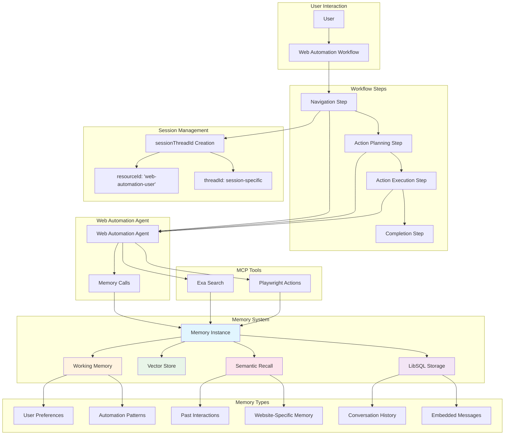
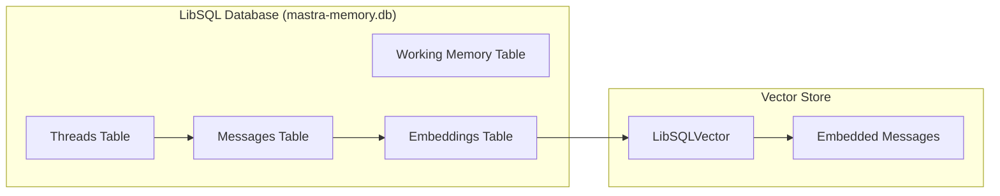
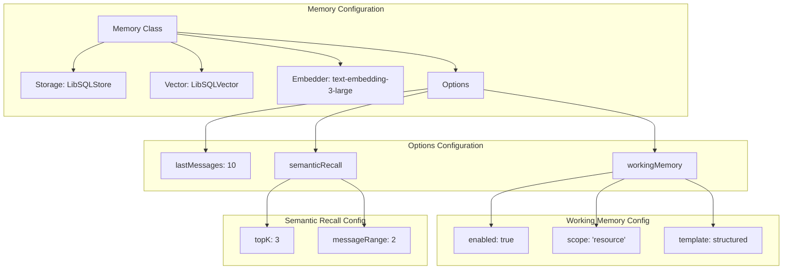
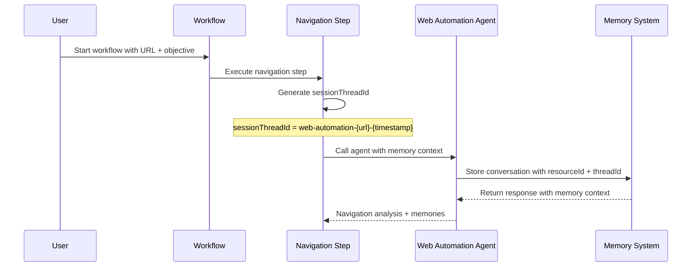
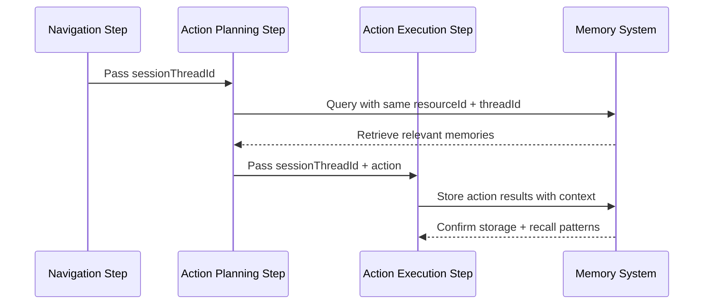
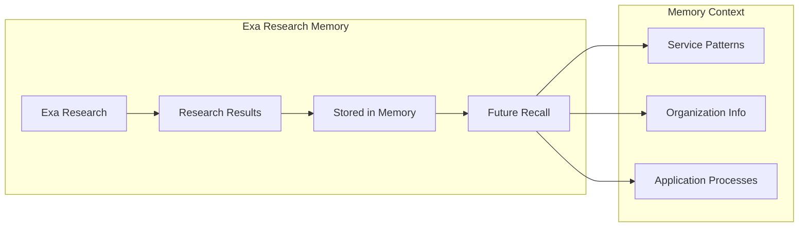
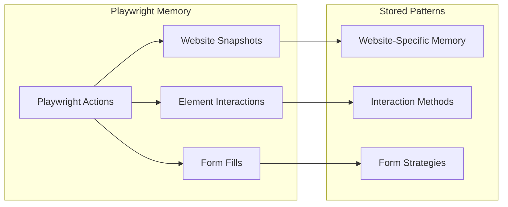

# Mastra Web Automation Memory Architecture

This document outlines the memory schema and architecture implemented in the web automation system.

## Overview

The web automation system uses a sophisticated memory architecture that enables:
- Cross-session persistence
- Semantic recall of past interactions
- Working memory for user preferences
- Conversation history tracking
- MCP tool call memory (Exa + Playwright)

## Memory Flow Architecture



## Memory Components

### 1. Storage Layer


### 2. Memory Configuration Schema


## Memory Flow Through Workflow

### 1. Session Initialization


### 2. Cross-Step Memory Continuity


## Memory Types and Usage

### 1. Working Memory
Stores structured user preferences and patterns:
```
- **Name**: User's preferred language
- **Description**: Language preference for web interactions
- **Value**: Spanish

- **Name**: Default address
- **Description**: User's primary address for form filling
- **Value**: 123 Main St, City, State, ZIP
```

### 2. Semantic Recall
Enables retrieval of relevant past interactions:
- Website-specific automation patterns
- Successful form completion strategies
- Error resolution methods
- User interaction preferences

### 3. Conversation History
Maintains chronological record:
- Last 10 messages per thread
- Cross-session conversation linking
- Context preservation between workflow runs

## MCP Tool Memory Integration

### 1. Exa Search Memory


### 2. Playwright Action Memory


## Key Features

### ✅ Cross-Session Persistence
- Same `resourceId` across different workflow runs
- Memories persist between sessions
- User preferences maintained long-term

### ✅ Workflow Memory Continuity  
- Single `sessionThreadId` across all workflow steps
- Each step builds on previous step's memory
- Context flows seamlessly through the workflow

### ✅ MCP Tool Memory
- Exa search results are remembered
- Playwright actions and patterns stored
- Research findings persist for future use

### ✅ Intelligent Recall
- Semantic search finds relevant past interactions
- Working memory provides structured data access
- Conversation history maintains chronological context

## Usage Examples

### Example 1: Cross-Session Memory
```typescript
// Session 1
workflow.start({ 
  url: 'bank.com', 
  objective: 'My preferred language is Spanish. Check account balance.' 
});

// Session 2 (days later)
workflow.start({ 
  url: 'bank.com', 
  objective: 'Login to account' 
});
// Agent remembers: "I recall you prefer Spanish from our previous session"
```

### Example 2: Website Pattern Learning
```typescript
// First visit to complex website
workflow.start({ 
  url: 'complex-gov-site.gov', 
  objective: 'Apply for service' 
});
// Agent learns: "For this site, must click 'Advanced Options' first"

// Future visits
workflow.start({ 
  url: 'complex-gov-site.gov', 
  objective: 'Check application status' 
});
// Agent applies: "Based on previous experience, clicking Advanced Options..."
```

## Technical Implementation

### Resource Identification
- **resourceId**: `'web-automation-user'` (consistent across all sessions)
- **threadId**: `web-automation-{sanitized-url}-{timestamp}` (per workflow session)

### Memory Storage Path
- **Database**: `file:../mastra-memory.db`
- **Vector Embeddings**: LibSQLVector with text-embedding-3-large
- **Scope**: Resource-level working memory

### Agent Model
- **Model**: `gpt-4.1` (upgraded for better memory utilization)
- **Tools**: MCP tools (Exa + Playwright) with memory context
- **Instructions**: Enhanced with memory-aware guidelines

This architecture enables the web automation system to become progressively smarter and more personalized with each interaction, remembering user preferences, successful patterns, and learning from past experiences. 